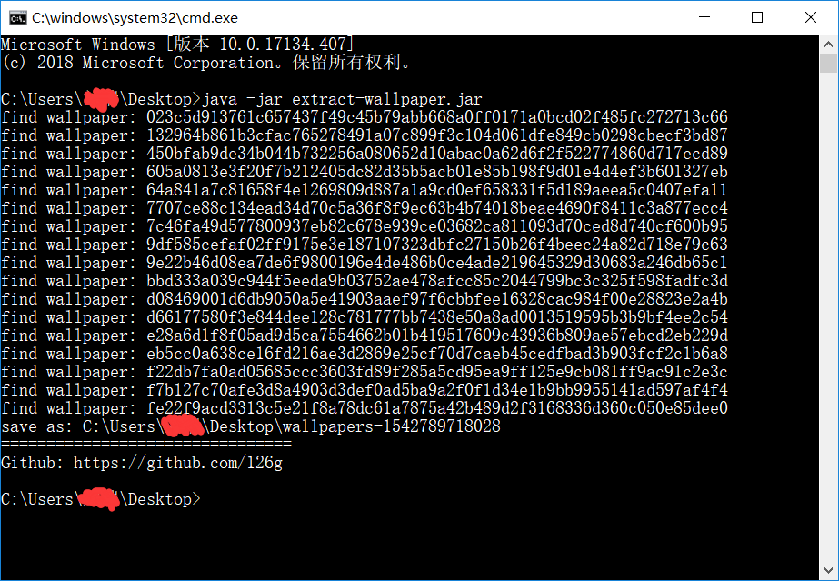
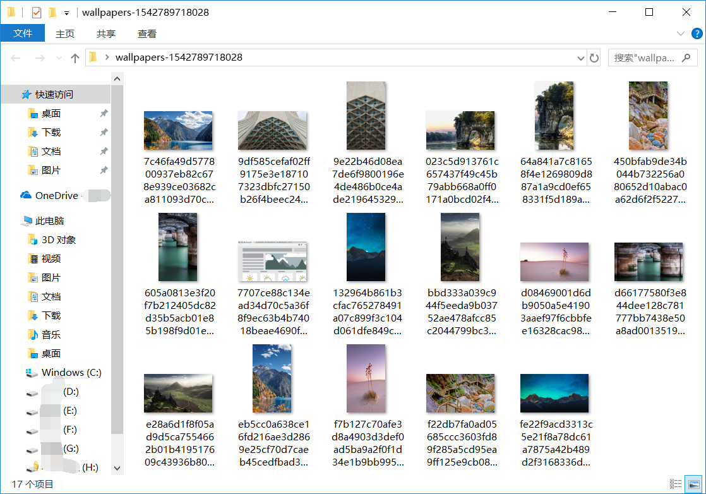

# extract-wallpaper
提取Windows 10锁屏壁纸的java小程序

看到某张锁屏壁纸，感觉不错，想提取出来

于是百度搜索方法，方法有很多

例如：[Win10锁屏壁纸怎么提取保存到本地](http://www.udashi.com/article/11604.html)

手动提取太麻烦，还要改后缀名，使用第三方软件提取又不想安装

不如自己写一个小程序，于是有个这个小程序

使用方法很简单，直接运行一下就好了，不需要任何参数

